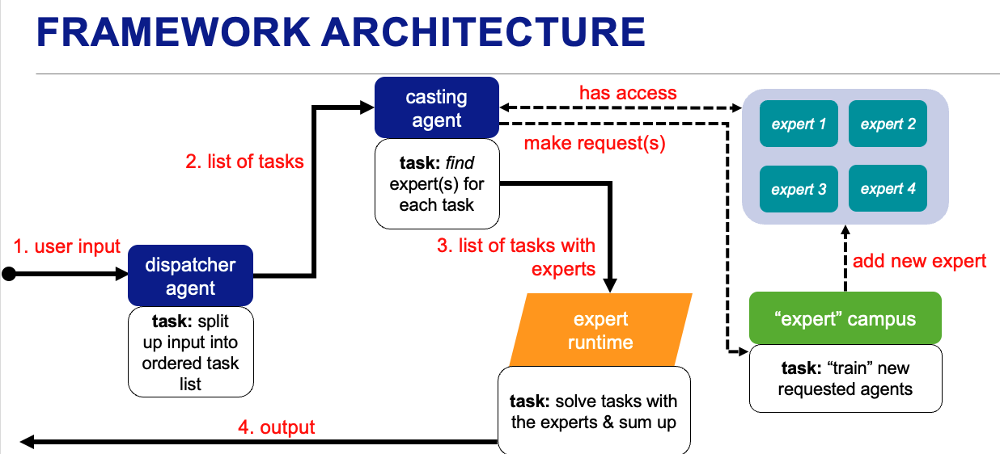

# ICLE — In-Context Learning Experts

**ICLE** is a multi-agent AI framework that dynamically trains and orchestrates specialized *Expert Agents* to solve complex, multi-step tasks. Experts are trained on-demand using **In-Context Reinforcement Learning (ICRL)** and persist across runs, accumulating refined strategies over time.



---

## How It Works

ICLE decomposes any task into a four-stage pipeline:

```text
User Input
    │
    ▼
┌─────────────┐     ┌──────────────┐     ┌───────────────┐     ┌─────────────┐
│  Dispatcher │────▶│    Caster    │────▶│    Runtime    │────▶│  Assembler  │
│             │     │              │     │               │     │             │
│ Breaks task │     │ Assigns the  │     │ Executes all  │     │ Synthesizes │
│ into a DAG  │     │ right expert │     │ tasks in      │     │ outputs into│
│ of sub-tasks│     │ to each task │     │ parallel      │     │ final answer│
└─────────────┘     └──────────────┘     └───────────────┘     └─────────────┘
```

### Pipeline Stages

| Stage | Agent | Responsibility |
| --- | --- | --- |
| **Dispatch** | `DispatcherAgent` | Decomposes the user's request into an ordered, dependency-aware task graph |
| **Cast** | `CasterAgent` | Assigns the best-fit Expert Agent(s) to each sub-task; trains new experts on-demand |
| **Runtime** | `Runtime` | Resolves the task DAG topologically; runs independent tasks in parallel via a thread pool; injects each task's declared dependency outputs as context into its prompt |
| **Assemble** | `Assembler` | Collects all sub-agent outputs and synthesizes a single coherent final response |

### The Campus — Expert Training & Storage

The **Campus** is where Expert Agents are born. When the Caster determines no suitable expert exists for a sub-task, it calls `train_new_expert`, which:

1. **Generates a training curriculum** — a synthetic sequence of progressively harder tasks tailored to the required domain
2. **Runs ICRL training** via [FastICRL](https://github.com/makoeta/FastICRL) — the agent iterates through tasks using an explore/exploit loop guided by reward signals
3. **Distills a strategy** — the agent's learned strategy is saved alongside its experience buffer as a `.yaml` file in the expert save directory

Saved experts are loaded automatically on future runs, so the pool of available specialists grows over time.

### Expert Assignment Modes

The `CasterAgent` supports two modes:

- **Single-Expert Mode** — assigns exactly one highly specialized expert per task
- **Multi-Expert Mode (MoE)** — assigns a thematically relevant general expert as coordinator plus one or more specialists per sub-task, following a Mixture-of-Experts architecture

---

## Installation

Requires Python ≥ 3.13 and [uv](https://docs.astral.sh/uv/).

```bash
git clone https://github.com/makoeta/ICLE.git
cd ICLE
make install        # runtime dependencies only
make install-dev    # + test dependencies (pytest, openai test client)
```

Copy the environment template and fill in your API key:

```bash
cp .env.example .env
```

```env
# .env
OPENAI_API_KEY=sk-...
```

---

## Quick Start

```python
from agno.models.openai import OpenAIChat
from icle import ICLE

model = OpenAIChat(id="gpt-4o")

pipeline = ICLE(
    model=model,
    global_task="Write poems.",
    expert_save_dir="./experts",
    multi_expert_mode=True,
)

result = pipeline.run("Write three poems: one about black holes, one about the deep ocean, and one about autumn.")
print(result.content)
```

On the first run the Caster will train any missing experts before executing. On subsequent runs, saved experts are reused immediately.

### Verbose Mode

Pass `verbose=True` to log every pipeline step — dispatched task graph, expert assignments, per-task runtime outputs, expert training, and the final synthesis — to the console **and** a log file:

```python
pipeline = ICLE(..., verbose=True)                       # logs to console + ./icle.log
pipeline = ICLE(..., verbose=True, log_file="run.log")   # custom log file
pipeline = ICLE(..., verbose=True, log_file=None)        # console only
```

Step summaries are logged at `INFO`; full step contents (system prompts — including each expert's learned strategy and experience buffer —, input prompts, task outputs, final answer) at `DEBUG`. Outside the pipeline you can enable the same logging directly:

```python
from icle.log_setup import enable_verbose_logging

enable_verbose_logging("icle.log")
```

---

## Project Structure

```text
src/icle/
├── __init__.py           # Top-level ICLE workflow (exports ICLE)
├── dispatcher/           # Decomposes input into a task graph
├── caster/               # Expert assignment & on-demand training
├── campus/               # Expert training via ICRL
│   └── models/           # ExpertConfig, TrainingTaskList
├── runtime/              # Parallel task execution engine
├── assembler/            # Output synthesis
└── models/               # Shared task models (DAG nodes)
tests/
├── data/                 # Example saved expert YAML files
└── {component}/          # Per-component test suites
```

---

## Dependencies

| Package | Role |
| --- | --- |
| [`agno`](https://github.com/agno-agi/agno) | Agent, Team, and Workflow orchestration |
| [`fasticrl`](https://github.com/makoeta/FastICRL) | In-Context Reinforcement Learning engine |
| `openai` | LLM backend |
| `pydantic` | Structured outputs and data models |
| `python-dotenv` | Environment configuration |

---

## Running Tests

```bash
make test          # unit tests only (no API calls)
make test-api      # full suite including live API calls
```

Tests require `make install-dev` to be run first.
